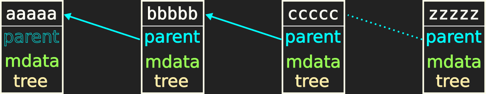
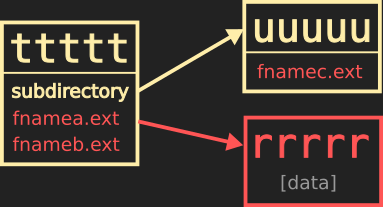
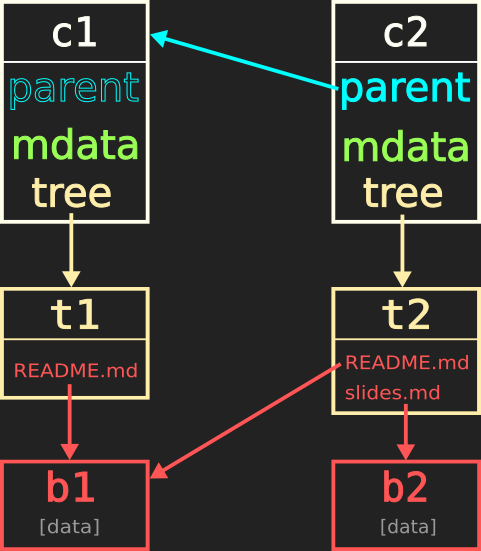
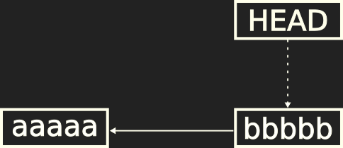
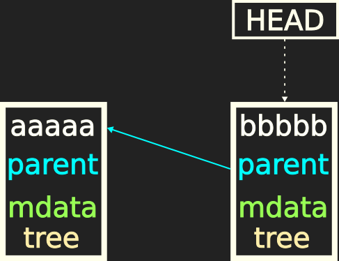

# Understanding Git

> Achilleas Koutsou

2018-11-14

---
<!---

# Part 0
## Preface


## Shell commands

Shell commands will be prefixed by `$` and the output will follow without any prefix:
```bash
$ echo "Like this"
Like this
```


## Variables instead of examples

Shell variable notation will be used in place of remote names, branch names, commit messages, etc.

For example:
```bash
$ git commit -m $commitmsg
$ git push $remote $branch
```

Instead of:
```bash
$ git commit -m "Initial commit: Add README and templates"
$ git push origin master
```
-->

---

# Part 1
## Porcelain and Plumbing

Note:
The Git manual and documentation pages separate commands into *porcelain* and *plumbing* commands. These are high level and low level commands, respectively. The metaphor being that *plumbing* is what happens behind the scenes, out of sight. In contrast, *porcelain* refers to the parts of the system that the user interacts with directly.

---

## Porcelain

`init`, `add`, `commit`, `push`, `pull`, `log`, `fetch`, `merge`, `rebase`, `clone`, `diff`, ...

*High level commands*

Note:
Anyone learning Git will first come into contact with *porcelain* commands: `add`, `commit`, `push`, `pull`, `log`, `fetch`, `merge`.

---

## Plumbing: Low level commands

`rev-parse`, `cat-file`, `ls-files`, `config`, `apply`, ...

*Low level commands*

Note:
Basic operations. Porcelain commands call one or (usually) more plumbing commands. Plumbing commands perform a single operation and are meant to be relied on for scripting or for building your own porcelain (interfaces to Git). They're stable, in other words, their output and operational details aren't expected to change often.

Examples: `apply`, `rev-parse`, `config`, `cat-file`, `ls-files`

---

## Our goal

Inspect the *plumbing* to gain a deeper understanding of the *porcelain*

Note:
I wont be talking much about individual plumbing commands, but we will be using some to inspect the inner workings of Git as we go along. For me today it's not important that you walk away with a bunch of new commands that you can use. I want you to walk away with a deeper understanding of Git's inner workings, to the point where you can apply that knowledge to create more powerful workflows yourselves.

If you're completely unfamiliar with Git, this talk will probably give you some basics to get started, but more importantly, it should give you enough knowledge so that if you go through a beginner's tutorial (of which there are plenty), it will be easier to *understand* the tutorial in more depth.

---

# Part 2
## What is Git and what does it do?

---

Which of these statements are true?
- Git is a version-control system for source code
- Git keeps track of file changes across versions
- Git is a backup tool

---

- Git is a version-control system for source code
    - Kinda
- Git keeps track of file changes across versions
    - Kinda
- Git is a backup tool
    - Not really

---

# Part 2.5
## Hash functions

---

What is a hash function?

- Deterministic
- Quick to compute
- One-way: easy to compute on any input; infeasible to invert given output
- Small changes in input map to large changes in output
- Collision free: infeasible to find two different inputs that map to the same output

---

Why do we care?

---

> Git is fundamentally a content-addressable filesystem with a VCS user interface written on top of it.

Source: https://git-scm.com/book/en/v2/Git-Internals-Plumbing-and-Porcelain

---

- Git is a key-value store: A database of objects where each object is addressable by its SHA-1 hash
- Every other feature is implemented by tools and functions that manipulate this database.

---

An example SHA-1 hash
```plaintext
32c65e86d72d50be78c536f79d8036604eb713b1
```

Short hash
```plaintext
32c65e8
```

Note:
A SHA-1 hash looks like a seemingly random sequence of 40 hexadecimal digits [0-9, a-f].

Git uses these hashes to identify all the objects it uses internally.

Git also accepts short versions of any hash, by using the first few characters, as long as it's unambiguous inside the repository (minimum 4).

---
# Part 3
## Get to the point

---

Let's start from scratch

```bash
$ git init
Initialized empty Git repository in $directory
```

Our object store is empty
```bash
$ tree -F .git/objects
.git/objects
├── info/
└── pack/

2 directories, 0 files
```
Note:
Let's start a Git repository from scratch. We'll make a couple of snapshots (commits) and drill down into each object to start building our understanding of the whole system.

We initialise a directory with the simple `git init` command. This just sets up the current directory we're working in as a Git repository.

Everything related to Git is stored under the `.git` directory, which resides under the directory where we ran `git init`. All the Git objects are stored in the `.git/objects` subdirectory. Since this is a fresh new repository, the object store is empty.

---

Add a readme
```bash
$ echo "# Understanding Git" > README.md
```
```bash
$ git add README.md
```
```bash
$ git commit -m "Initial commit: Add README"
[master (root-commit) 10f21b8] Initial commit: Add README
 1 file changed, 1 insertion(+)
 create mode 100644 README.md
```

Note:
Let's create a README and add the first commit. To create a first commit, we first need to *add* the changes we want to record into the *commit*. Remember, a commit is a snapshot of the repository, but we need to tell Git which files and file changes we want to add to the snapshot. We *add* the README to Git using the `add` command.  We create a *commit* using the `commit` command. The `-m` option in the co`commit` command lets us add a message to describe the snapshot. If we didn't add this, Git would open a text editor to ask us for a message.

Nb: Empty commit messages are allowed, but it's almost never a good idea to create a commit without a descriptive message, so by default Git wont let you create a commit without a message.

---

Check the object store again
```bash
$ tree -F .git/objects
.git/objects
├── 32/
│   └── c65e86d72d50be78c536f79d8036604eb713b1
├── 55/
│   └── 2e539f0238d49549d0f7be59f6b8aae99c57c3
├── dc/
│   └── d0c23a90b9a55df7caa0c5c182254ace2e0be4
├── info/
└── pack/

5 directories, 3 files
```

Three objects. What do they represent?

Note:
Checking the object store again, we see that Git has created some objects.

Git stores its contents (zlib) compressed, so we can't just open the files to see inside, but we can start using some *plumbing* commands to inspect Git's internals.

---

Our first plumbing command
- `cat-file`: shows information about or content of a Git object
    - `-t`: print type of object
    - `-p`: pretty-print contents of object

Note:

`cat-file`: shows information about or content of a Git object

We will use two options or variants of the `cat-file` command.
- `-t`: print type of object
- `-p`: pretty-print contents of object

`pretty-print` is a commonly used term for printing data in a human-readable format. It usually implies that data is indented or coloured in ways that make it easier to understand but wouldn't be good to work with programmatically.

---

```bash
$ git cat-file -t 552e539f0238d49549d0f7be59f6b8aae99c57c3
commit
```
```bash
$ git cat-file -p 552e539f0238d49549d0f7be59f6b8aae99c57c3
tree dcd0c23a90b9a55df7caa0c5c182254ace2e0be4
author Achilleas Koutsou <ak@example.com> 1542119518 +0100
committer Achilleas Koutsou <ak@example.com> 1542119518 +0100

Initial commit: Add README
```

Note:
First object is a `commit`. It's the revision or snapshot we made with the `git commit` command. If we print its contents, we can see all the information associated with the commit.

Note the commit message we used.

The author and committer with the email addresses are added automatically, based on the global (or local) git configuration.
We'll refer to this information, along with the date and timestamps, as the *metadata* of the commit.

You may notice one more piece of information there: The `tree`. This is a reference to the next object we'll inspect.

---

```bash
$ git cat-file -t dcd0c23a90b9a55df7caa0c5c182254ace2e0be4
tree
```
```bash
$ git cat-file -p dcd0c23a90b9a55df7caa0c5c182254ace2e0be4
100644 blob 32c65e86d72d50be78c536f79d8036604eb713b1    README.md
```

Note:
A `tree` is analogous to a filesystem directory. It contains a list of references to files: in this case, the README file we added to the commit with the `git add` command.

It can also contain references to other trees, the same way a directory can have subdirectories.

Finally, the third object we'll inspect again appears here: It's a reference to the file `README.md`.

---

```bash
$ git cat-file -t 32c65e86d72d50be78c536f79d8036604eb713b1
blob
```
```bash
$ git cat-file -p 32c65e86d72d50be78c536f79d8036604eb713b1
# Understanding Git
```

Note:
Git uses the term `blob` to refer to file contents. Note that the file name `README.md` doesn't appear anywhere in the blob, only its contents. At the blob level, Git doesn't care about the name of the file. That information is stored in the tree which we saw earlier. The entry in the `tree` object is linked to the `blob` object using the key (hash).

---

## Git objects

- Commit: A single snapshot of the repository
- Tree: The equivalent of a directory
- Blob: The contents of a file

Note:
That's basically all the main objects that Git uses.

A `commit` is a snapshot of the repository. It contains a message, some metadata, and a reference to a tree.

A `tree` is the equivalent of a directory. It contains references to other trees and blobs along with the name (and mode) for each.

A `blob` is the equivalent of a file. It is simply the contents of a file checked into Git.

---
Second commit

```bash
echo "# Understanding Git

> Achilleas Koutsou

2018-11-14" > slides.md
```
```bash
$ git add slides.md
```
```bash
$ git commit -m "Add first presentation slide"
[master e9cb79d] Add first presentation slide
 1 file changed, 1 insertion(+)
  create mode 100644 slides.md
  ```

Note:
Let's create a second commit and run through our inspection process again.

---
```bash
$ tree -F .git/objects
.git/objects
├── 32/
│   └── c65e86d72d50be78c536f79d8036604eb713b1
├── 38/
│   └── 781ad1a6eb9cd94c0db2bffabe71a9fc7084a1
├── 45/
│   └── 8334281a1cfca627123e2551a8dabcbd5923cf
├── 94/
│   └── 6086806911f33c726b8e4088bb3ea5a28ac7a2
├── 9a/
│   └── d0e42db978b24a42b0de609a7eadcf1d5f04dd
├── dc/
│   └── d0c23a90b9a55df7caa0c5c182254ace2e0be4
├── info/
└── pack/

8 directories, 6 files
```

3 new objects

Note:
There's 6 objects now. If we compare the hashes with the previous time we checked the object store, we'll see that three of the objects are the same. So three new objects were created. Knowing what we know about the state of the object store after the first commit, we can probably guess what the new objects are.

Let's have a look at the new files.

---

```bash
$ git cat-file -t 3730b6b0b056419d7bf73ecc1228e340958a0960
commit
```
```bash
$ git cat-file -p 3730b6b0b056419d7bf73ecc1228e340958a0960
tree 38781ad1a6eb9cd94c0db2bffabe71a9fc7084a1
parent f5c1d92ed327382286b4ebe498a15b32211f99b8
author Achilleas Koutsou <ak@example.com> 1542124625 +0100
committer Achilleas Koutsou <ak@example.com> 1542124625 +0100

Add first presentation slide
```

Note:
Just like last time, the first object is a `commit`. It's our new commit, where we added the presentation slide. Notice anything different?

This commit has one extra bit of information. It has a `parent`! I think we can all guess what that refers to.

If you look at the hash, it's the key of the first (initial) commit. Let's look at the other two new objects and then return to this.

---

```bash
$ git cat-file -t 38781ad1a6eb9cd94c0db2bffabe71a9fc7084a1
tree
```
```bash
$ git cat-file -p 38781ad1a6eb9cd94c0db2bffabe71a9fc7084a1
100644 blob 32c65e86d72d50be78c536f79d8036604eb713b1    README.md
100644 blob 946086806911f33c726b8e4088bb3ea5a28ac7a2    slides.md
```

Note:
Again, the second object is a `tree`. The tree now has two entries. The README.md from before and the slides.md we just added.

Note that the key for the README.md file is the same as before. Since the file wasn't modified, it's contents are the same and so the hash of the contents are the same.

---

```bash
$ git cat-file -t 946086806911f33c726b8e4088bb3ea5a28ac7a2
blob
```
```bash
$ git cat-file -p 946086806911f33c726b8e4088bb3ea5a28ac7a2
# Understanding Git

> Achilleas Koutsou

2018-11-14
```

Note:
The third new object is the contents of slides.md, as expected.

---

## New information
- The new commit has a `parent`
- The new `tree` contains one new and one old object: Unchanged files don't create new objects

Note:
So what we've learned here is that the new commit has a `parent` reference, which points to the previous (first) commit. Also, the new tree is completely new: one of the two objects is the same as it was in the previous tree.

---

## Let's revise

- A revision (commit) consists of:
   - `parent`: A reference to a parent commit (the *previous* commit in history; except when it's the first commit)
   - `tree`: A reference to a tree (the top-level directory)
   - Metadata: Author, committer, message, date & time

---

- A tree consists of references to blobs and other trees
- A blob is simply the contents of a file

---

## Revision graph


Note:
Currently, our Git repository's history looks like this. We have an initial commit, and a followup commit that references the initial one.

---

## Revision graph


Note:
Let's generalise the graph and assume we have a lot more commits.

---

## Revision graph



Note:
Add the information we know are contained in a commit

A parent link that points to the previous commit

Some metadata (which we don't really care about now)

And a tree.

Note that the first commit has no parent, but for consistency we're keeping the general form of the object.

---

## Trees and blobs




Note:
We've seen that trees are lists of filenames, but they can also hold subdirectories, which are references to other trees.

With all this, we can now draw a graph of our actual repository.

---

## Our repository



Note:
Notice that the readme in the second tree points to the same blob from the first tree.

---

`rev-parse`
  - A plumbing command used internally for parsing flags and revision arguments

`HEAD`
  - The head (tip) of the current branch
  - Points to the revision in the working directory (before any uncommitted changes)

---

```bash
$ git rev-parse HEAD
10f21b8ddd8fa6ea61fc1e3bb72ae448c5129515
```

Translates symbolic name `HEAD` to the `SHA-1` key

---

`cat-file`

---

What *type* (`-t`) of object is `HEAD`?

```bash
$ git cat-file -t HEAD
commit
```

---

Show me (`-p` print) the *contents* of `HEAD`

```bash
$ git cat-file -p HEAD
tree dcd0c23a90b9a55df7caa0c5c182254ace2e0be4
author Achilleas Koutsou <achilleas.k@gmail.com> 1542042136 +0100
committer Achilleas Koutsou <achilleas.k@gmail.com> 1542042136 +0100

Initial commit: Add README
```

---

---

Our current `HEAD` is the first commit; it doesn't have a parent.

---


Simplified commit graph



- Child commit `bbbbb` points to parent `aaaaa`
- `HEAD` is a symbolic reference to `bbbbb`

---

Full commit graph



---

Full commit graph with tree representations


---

```bash
$ git cat-file -t dcd0c23a90b9a55df7caa0c5c182254ace2e0be4
tree
```
```bash
$ git cat-file -p dcd0c23a90b9a55df7caa0c5c182254ace2e0be4
100644 blob 32c65e86d72d50be78c536f79d8036604eb713b1	README.md
```
```
$ git cat-file -t 32c65e86d72d50be78c536f79d8036604eb713b1
blob
```
```
$ git cat-file -p 32c65e86d72d50be78c536f79d8036604eb713b1
# Understanding Git
```

---

# Part N
## Workflows

---

# Add Commit Push

```bash
$ git add $filename
$ git commit -m $commitmsg
$ git push $remote $branch
```

---

# Pull
## Fetch & Merge

```bash
$ git fetch $remote
$ git merge $remote/$branch
```
